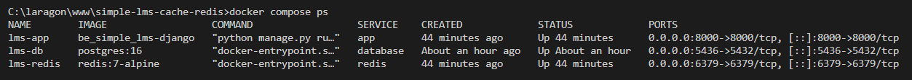

## Kode yang Dimodifikasi

### weather_api.py (sebelum dimodifikasi)
```python
import requests
import time

def get_weather(city):
    """Simulasi API call yang lambat"""
    time.sleep(2)  # Simulate slow API
    response = requests.get(f"https://api.example.com/weather/{city}")
    return response.json()
```

### weather_api.py (sesudah dimodifikasi — dengan Redis Cache)
```python
import time
import redis
import json

# Koneksi ke Redis container
r = redis.Redis(
    host='redis',
    port=6379,
    db=0,
    decode_responses=True
)

def get_weather(city):
    cache_key = f"weather:{city}"

    # 1. Cek cache Redis dulu
    cached_data = r.get(cache_key)
    if cached_data:
        print("Data diambil dari CACHE Redis")
        return json.loads(cached_data)

    # 2. Cache miss — simulasi panggil API (lambat)
    print("Data diambil dari API")
    time.sleep(2)

    weather_data = {
        "city": city,
        "temperature": 30,
        "condition": "Cerah"
    }

    # 3. Simpan ke Redis selama 300 detik (5 menit)
    r.set(cache_key, json.dumps(weather_data), ex=300)

    return weather_data
```

---

## Perintah Redis yang Digunakan

### SET
Menyimpan data ke Redis dengan masa berlaku 300 detik.
```
r.set(cache_key, json.dumps(weather_data), ex=300)
```

### GET
Mengambil data dari Redis berdasarkan key.
```
r.get(cache_key)
```

### EXPIRE / ex=300
Mengatur masa aktif cache selama 300 detik (5 menit).
Setelah 300 detik, data otomatis dihapus dari Redis.

---

## Hasil Pengujian

### Screenshot 1 — Docker Compose PS
> Membuktikan semua container berjalan: lms-app, lms-db, lms-redis

Jalankan:
```bash
docker compose ps
```



---

### Screenshot 2 — Redis Ping
> Membuktikan Redis terinstall dan berjalan normal

Jalankan:
```bash
docker compose exec redis redis-cli ping
```

[TEMPEL SCREENSHOT redis-cli ping DI SINI]

---

### Screenshot 3 — Hasil test_cache.py
> Menunjukkan perbedaan waktu First Call (lambat) vs Second Call (cepat)

Jalankan:
```bash
docker compose exec app python test_cache.py
```

[TEMPEL SCREENSHOT output test_cache.py DI SINI]

---

### Screenshot 4 — Redis CLI: KEYS * dan GET weather:Jakarta
> Membuktikan data cuaca tersimpan di Redis setelah First Call

```bash
docker compose exec redis redis-cli
KEYS *
GET weather:Jakarta
```

[TEMPEL SCREENSHOT KEYS * dan GET weather:Jakarta DI SINI]

---

### Screenshot 5 — Redis CLI: TTL weather:Jakarta
> Membuktikan cache memiliki masa berlaku (countdown dari 300 detik)

```bash
TTL weather:Jakarta
```

[TEMPEL SCREENSHOT TTL weather:Jakarta DI SINI]

---

## Jawaban Pertanyaan

### 1. Mengapa waktu respons berbeda?
First call membutuhkan waktu ~2 detik karena harus memanggil API
(disimulasikan dengan `time.sleep(2)`). Hasilnya kemudian disimpan di Redis.

Second call hanya membutuhkan ~0.00 detik karena data langsung diambil
dari Redis yang menyimpan data di RAM, tanpa perlu memanggil API lagi.

### 2. Apa keuntungan caching?
- Mempercepat waktu respons API secara drastis
- Mengurangi beban server dan database
- Mengurangi jumlah request berulang ke API eksternal
- Menghemat resource dan biaya server

### 3. Kapan sebaiknya tidak menggunakan cache?
- Saat data harus selalu real-time dan up-to-date
- Saat data berubah sangat sering (setiap detik)
- Saat data bersifat sensitif dan personal (data keuangan, medis)
- Saat memori/RAM terbatas

---

## Penjelasan Third Call
Jika `get_weather()` dipanggil setelah 5 menit (300 detik),
cache di Redis sudah expired (TTL = 0).
Redis akan mengembalikan `None`, sehingga fungsi akan memanggil
API kembali dan waktu respons akan kembali lambat ~2 detik
seperti First Call.
